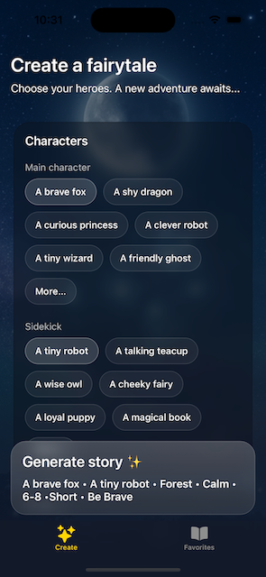
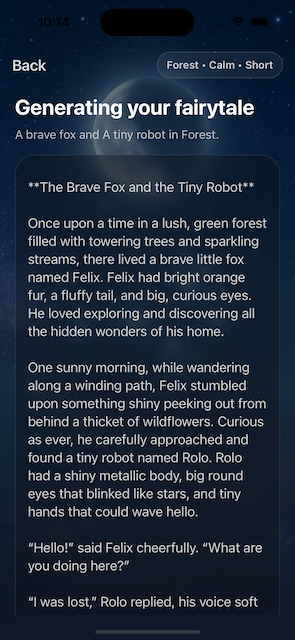
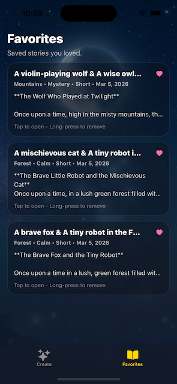
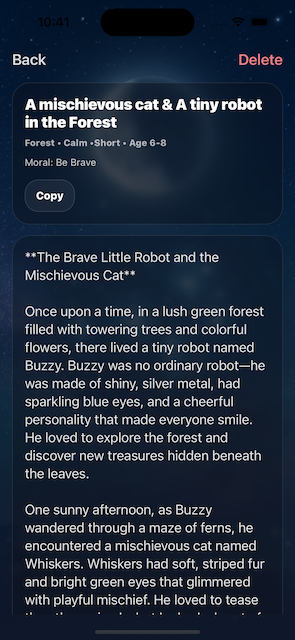

# ✨ Fairytale: AI-Powered Fairy Tale Generator

Fairytale is a magical mobile application built with React Native (Expo) that weaves personalized bedtime stories for children. Using the latest OpenAI Responses API, the app allows parents to choose characters, settings, and moral lessons, instantly generating a unique fairy tale.

---

# ✨ Features

## 🪄 AI Story Generation

Users can generate unique fairytales by selecting:

- Main character
- Sidekick
- Setting
- Tone
- Moral
- Story length
- Target age

Stories are generated using an **LLM API**.

---

## ❤️ Favorites

Users can save their favorite stories locally.

Features:

- Favorite / unfavorite stories
- Persistent storage
- Quick access from the Favorites tab

---

## 📖 Story Reader

Dedicated screen for reading generated stories.

Features:

- Clean reading UI
- Copy story to clipboard
- Favorite / unfavorite
- Delete story

---

## 🎨 Liquid Glass UI

The app uses a **modern "liquid glass" inspired UI**:

- Blur backgrounds
- Gradient aurora effects
- Soft translucent cards
- Smooth animations

Libraries used:

- `expo-blur`
- `expo-linear-gradient`
- `react-native-reanimated`

---

# 📱 Screens

| Screen        | Description                |
| ------------- | -------------------------- |
| **Create**    | Configure story parameters |
| **Generate**  | AI generates the story     |
| **Favorites** | Saved stories              |
| **Story**     | Full story reader          |

---

# 🛠 Tech Stack

## Core

- **React Native**
- **Expo**
- **Expo Router**

## AI

- LLM API integration via `fetch`

## Storage

- `AsyncStorage` for local persistence

## UI

- `expo-blur`
- `expo-linear-gradient`
- `react-native-reanimated`

## Haptics

- `expo-haptics`

## Clipboard

- `expo-clipboard`

---

# 🔐 Environment Variables

Create a `.env` file:
EXPO*PUBLIC_OPENAI_API_KEY=your_api_key_here
Expo exposes variables prefixed with `EXPO_PUBLIC*`.

The `.env` file is ignored in Git.

# 🚀 Running the Project

Install dependencies:
npm install
npx expo start -c

# 🎯 Purpose of This Project

This project demonstrates:

- Mobile AI integration
- Modern React Native architecture
- Expo Router navigation
- Local data persistence
- Clean UI patterns

# 📸 Demo

